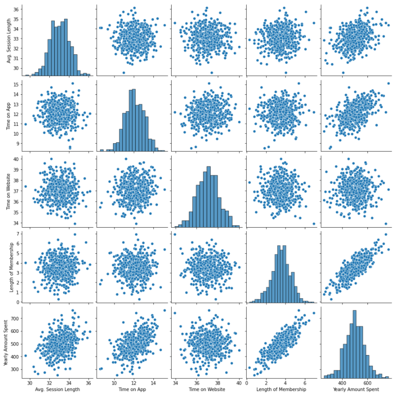

# Análise de dados de compras com Machine Learning e Python

> Este projeto utiliza análise exploratória de dados e Machine Learning para compreender o que faz um cliente gastar mais em um site de compras

A situação (hipotética e didática) em questão é que uma empresa gostaria de compreender, a partir dos dados, o que faz seus clientes gastarem mais em seu site, para que possam aprimorar essas características e alcançar um valor de venda maior.

Para isso, utilizamos Python para fazer uma análise exploratória de dados e tirar algumas conclusões acerca das relações entre as variaveis do _dataset_ fornecido. Como existem relações lineares entre o a quantidade de dinheiro gasto e algumas variáveis, foi treinado um modelo de Regressão Linear para avaliar os dados.



### Instalações de dependências
Linux & Windows

```sh
pip install pandas
pip install numpy
pip install matplotlib
pip install seaborn
pip install scikit-learn
```

### Conclusões sobre os dados
Foi possível concluir que a variável mais importante é o **tempo de membro fidelidade**, de modo que a cada ano a mais que o usuário é membro, tende a gastar \$61 a mais. Outra variável importante é o **tempo gasto no app**, de modo que a cada minuto a mais gasto no app, o usuário tende a gastar \$38 a mais.